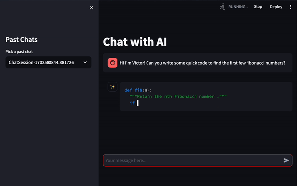

# AI Chat UI (Proof of Concept)

This demonstrates a simple UI (using Streamlit's [Chat elements](https://docs.streamlit.io/library/api-reference/chat)) that uses interacts with an AI via an api (Google's [Gemini model](https://ai.google.dev/docs/gemini_api_overview) here).

## Demo

## Install

0. Ideally create a new Python environment (`venv`, `conda`, etc.).
    - Tested on Python 3.11.5
1. Run `pip install -r requirements.txt` to install relevant packages.
2. Get an API key from Google's Google AI Studio formerly [MakerSuite](https://makersuite.google.com/app/apikey).
    - See the Gemini API [docs](https://ai.google.dev/tutorials/setup) for more details.
3. Add your API key as an environment variable called `GOOGLE_API_KEY`.
    - If you are on a Mac, this likely is editing `~/.zshrc` or `~/.bashrc` and adding `export GOOGLE_API_KEY=...` with your own key. Make sure you reload the shell.
    - If you're having trouble and like to just get it to work, you can change the app script `app_chat.py` so the variable `GOOGLE_API_KEY` is set to the string value of your key. Note this is a bit more risky but probably fine if you're testing out without public access.
4. Run in your terminal: `streamlit run app_chat.py`.
    - When using a Python environment, make sure `streamlit` is the correct one associated with your environment. Seen some weirdness before with `conda` and the shell not picking up the correct `streamlit`; had to manually call it with something like `MyUser/conda/envs/my_env/bin/streamlit`.
5. Browser should open where you can now interact with the UI! Otherwise, you might have to go to http://localhost:8501/ manually.